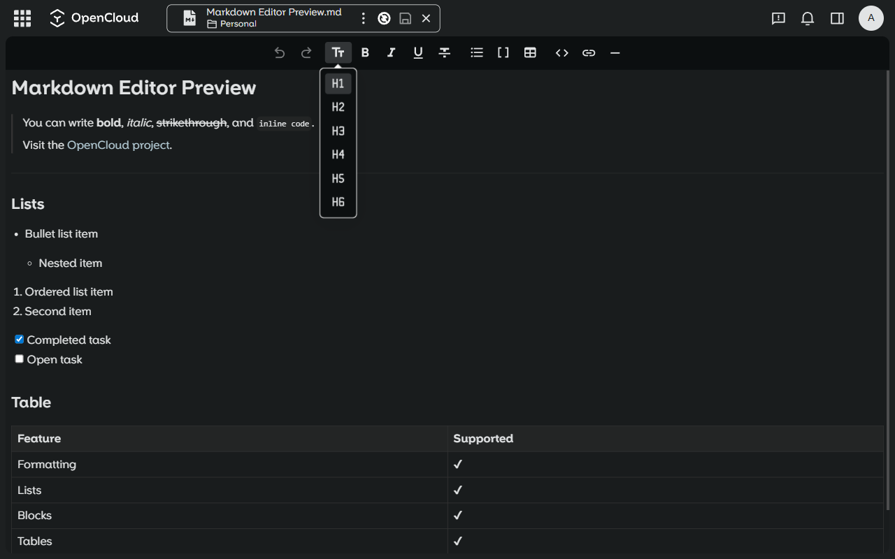
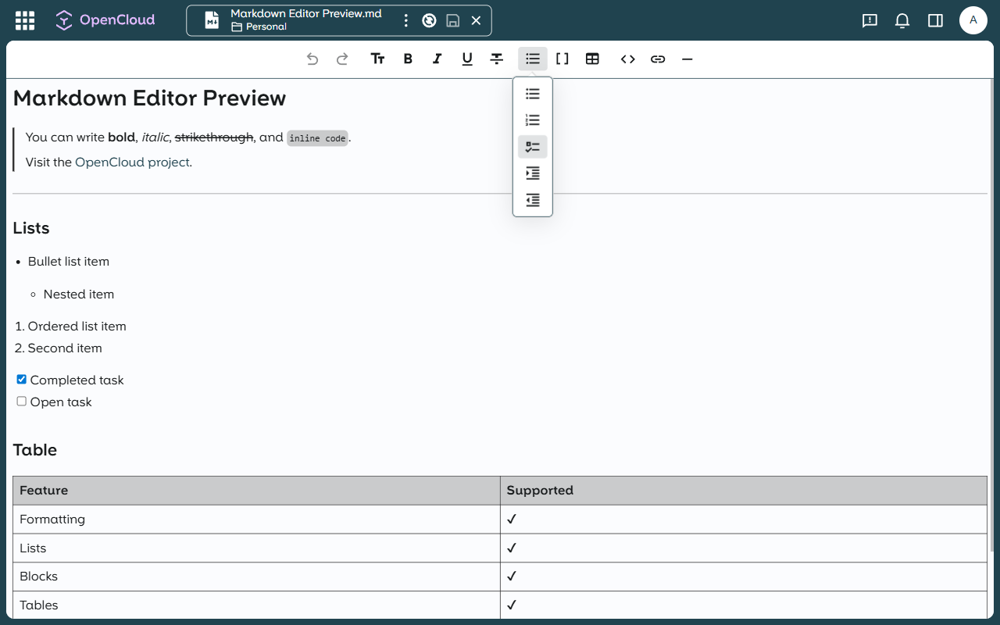

# OpenCloud Markdown Editor

A WYSIWYG Markdown editor for [OpenCloud](https://opencloud.eu/) using the [Tiptap](https://tiptap.dev/) library. It replaces the default editor for Markdown files (previously the Text Editor, which remains accessible via the "Open with…" menu).

